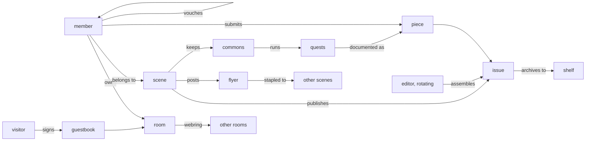

# Design

The machine, whole. CHARTER.md is the law; this is what runs under it. The organizing rule for everything below: every object must live inside at least one loop, and a proposed feature that joins no loop does not ship.

## Refusals

The system is defined by what it will not contain, so the refusals come first.

No feed. No infinite scroll. No follower counts, like tallies, view counts, or trending. No recommendation engine. No quote-post across scenes; no dunk mechanic at all. No DMs (the group chat already exists and is good; Stoop is the porch, the group chat is the backstage, and we compose with it rather than replace it). No video hosting (link out; video is the cost center and the attention sink that would quietly reintroduce everything refused above). No global search and no global namespace of content, because nothing global exists to search. No read receipts, no presence surveillance, no red badge counts. No time-on-site anything.

Two consequences worth naming. First, the expensive parts of modern social infrastructure (relays, global indexes, ranking services, video CDNs) exist to serve global surfaces; with no global surface, the whole system runs at porch-light wattage, which is what makes the economics of CHARTER Article V honest. Second, the engagement mechanics that under-16 laws now enumerate are absent by construction, not by compliance effort; keeping it that way is a standing design invariant.

## Objects

**Room.** A member's page: a place, not a profile row. Skinnable with real HTML/CSS inside a sandbox, one optional autoplay track (rights-clear only: your band, netlabels, CC audio; everything else links out), an about, a shelf of current obsessions, the crew rail (eight slots, chosen by hand, agonized over, reborn from the Top 8), a guestbook, and the light. Technically a signed data repo compiled to static HTML; exportable whole at any moment (CHARTER III.5); useful at n=1 as a personal site that syndicates outward.

**Light.** Manual presence. You turn it on when you are sitting on the stoop and open to visitors; you turn it off when you are not. Never automatic, never inferred, never logged. The status dot encodes on the blue/orange axis (orange lit, grey off), never red/green, and color is never the sole carrier.

**Scene.** The group: vouched members, soft cap near 150, a shared aesthetic (skins), a calendar, a corkboard, a commons, a zine, and a public stoop where anyone can knock. Scenes fork when they outgrow themselves, and the fork carries a copy of the commons with it.

**Piece.** A unit of work submitted for an issue: essay, photo set, mix, repair log, recipe, comic, one-liner. Pieces belong to their maker and appear in issues by inclusion, not by posting into a void.

**Issue.** The heart. Each scene publishes its zine on a rhythm it chooses; submissions accumulate through the cycle; the editor of the cycle assembles, sequences, and writes the editor's note; the issue drops at the set hour, whole. It is finite and everyone reads the same object. Issues archive to the shelf, and every issue exports print-ready (riso and photocopier friendly by construction, since the screen aesthetic is already 1-bit), so the digital zine and the paper zine on the record-store counter are the same artifact.

**Editor.** A rotating role, cycle by cycle, like dish duty in a co-op house. The algorithm is a neighbor with a name who owes the room dinner-table accountability. Scenes may tip editors from the treasury (CHARTER V.2).

**Shelf.** The archive: issues, court records, quest documentation. Memory instead of stream. Streams forget; shelves remember.

**Flyer.** The only object that travels between scenes, and therefore the only virality in the system: an invitation. A show, a skill-share, a work day, a call for collaborators. Signed by its scene; carries time, place (at whatever precision the scene chooses; "ask a member" is a valid address), and provenance.

**Staple.** The act of posting a flyer to another scene's corkboard, permitted only by that scene's standing consent (CHARTER II.4). Gossip structurally cannot travel; an invitation can.

**Guestbook.** Comments as visits. Signing a guestbook is leaving a trace at someone's place, under your name, where they live. The register is different from replying at someone, and the register is the point.

**Vouch.** Two members stake their listed names to bring in a human. The vouch record travels with the member; sybil pairs are cheap in theory and expensive in practice because scenes admit members (the network does not), scenes are small enough that everyone is seen, and your name sits on what you vouched for.

**Rounds.** Discovery by walking: webring edges between consenting rooms, scene directories that read like a flyer wall, guestbook traces where you have been. Serendipity via edges, not ranking.

**Commons.** The scene's accumulated capability: a wiki, the skill ledger (who can teach what), the tool library, and quests: collective real-world projects (fix ten bikes, feed the block, record the compilation) whose documentation becomes issue material.

## The graph

## The loops

The connections are the design. Each loop closes back on lived life; that closure is what "pointed at the physical world" means mechanically.

1. **Publication.** Live, make, submit; the editor assembles; the issue drops at the bell hour; everyone reads the same finite object; the guestbooks fill; the talk feeds the next cycle. Anticipation replaces compulsion. The notification is a church bell, not a slot machine.
2. **Invitation.** A scene posts a flyer; staples carry it to consenting corkboards; humans end up in a room together; the documentation comes back as pieces; the issue makes the next flyer easier to say yes to. The only thing that spreads is the thing that gathers.
3. **Trust.** Vouched members do work; work earns the standing to vouch; names-on-vouches make trust a form of social collateral rather than a CAPTCHA. In a majority-bot internet, this loop is the moat.
4. **Commons.** Quests teach skills; the ledger records who can now teach them; capability compounds; bigger quests become possible. Forks copy the commons, so the federation's growth mechanism is also its knowledge transfer mechanism.
5. **Energy.** The watt budget forces the 1-bit aesthetic; the aesthetic is the identity; the identity is the politics; the politics keep costs near zero; the dues surplus flows to tools and shows; the shows feed the invitation loop. Constraint, style, money, and meaning are one circuit.

## Rhythm

Notification policy, exhaustively: issue drop, guestbook signature, knock at the stoop, flyer stapled to your corkboard, vouch request. Nothing else exists to notify about. All five are batchable and default to the scene's own cadence. No red dots; a bell schedule.

The cycle is the clock of the whole system. A scene choosing weekly lives weekly; a scene choosing monthly lives monthly. Nothing anywhere refreshes.

## Trust and moderation

Intra-scene moderation is a dinner-party problem and stays one: scene norms, editor discretion within an issue, membership decisions by the scene's own process (CHARTER II.1). Inter-scene friction is handled at the staple layer first (revoke consent, unstaple, done) and by the court for what remains (CHARTER VI). The court's record goes on the shelf, readable whole.

The public stoop (CHARTER II.3) is the anti-clique valve: vouching may be selective, reachability may not. Every scene has a door, and anyone can knock at it.

## Data and federation

AT Protocol lexicons under a `town.stoop.*` namespace: `room`, `light`, `scene`, `piece`, `issue`, `flyer`, `staple`, `vouch`, `guestbook.entry`. Members' repos live on any PDS; a scene is itself a repo; rooms and issues compile to static HTML that any dumb host can serve. The app is a composer and a renderer, never a gatekeeper.

Stoop needs no relay and no appview at global scale, because there is no global surface to serve; the rounds run on an opt-in registry, which is a text file's worth of infrastructure. Credible exit is a repo export (rooms, graph, commons) any member can trigger; this is the CHARTER III.5 mechanism, not a courtesy.

Bridges: POSSE outward to the dying networks (a room can syndicate); read-bridges from ActivityPub where a scene wants them. Stoop rides rails that Free Our Feeds is independently working to keep billionaire-proof, and adds nothing to the protocol layer that would require trusting us.

## Energy and aesthetic

Budget first, look second, and they turn out to be the same thing. Pages stay under a megabyte; images ship dithered (1-bit and riso-grain, which is also the print bridge); no video; system fonts; static output. A scene's whole presence should serve from a machine drawing single-digit watts, Low-tech Magazine style, and the flagship's battery meter renders in the header as an honest instrument. In long rain the solar instance goes down, and that is a feature: a memento that the network is a physical thing on one physical planet.

Accessibility rides the same choices: 1-bit contrast is high contrast; color never carries meaning alone; meaning-bearing color pairs sit on the blue/orange axis, never red/green; captions are zine culture already.

## Economics

CHARTER Article V holds the law; the numbers that make it real: a 25-member scene at sliding-scale dues around $3 pools about $75 monthly against single-digit hosting costs, and the surplus is the point: editor tips, the tool library, the print run, the show. Cohost's autopsy (30K users, 2,630 payers, $17K monthly deficit) is the boundary condition this design is built to never approach: no salaries at the start, no island infrastructure ever, costs pinned to the watt budget.

## Growth and measurement

Growth is mitosis and hand-to-hand vouching. There is no growth team and nothing for one to optimize; noplace took $19M of venture money into the nostalgia lane, which by the enshittification cycle means that lane is pre-tainted, and this system is unfundable by construction instead. Slow is the cost and the point: zines spread hand to hand.

What we measure, since engagement is unconstitutional: the Issue #2 rate (scenes that ship a second issue; the founding gate), median issues per scene-year, quest completions, ledger growth (skills newly teachable), flyers that ended with humans in a room. A scene going quiet is not churn; it is a scene resting. The system must never learn what a DAU is.

## Staging

- **Stage 0, one scene, hand tools.** Rooms as static pages, the zine assembled by hand, the group chat as backstage. The software is a static generator and taste. Gate: Issue #2 ships.
- **Stage 1, the scene tool.** The composer (submission box, editor's board, issue build), the room editor with skin sandbox, corkboard, shelf. One small host.
- **Stage 2, federation.** The lexicons, vouch records, rounds registry, credible-exit export, POSSE bridges. A second and third scene that we did not found.
- **Stage 3, the cooperative.** Charter ratified by enough scenes to mean something, court seated, flagship host with the solar instance and the meter in the header, print bridge in every scene's hands.

## Open questions

The name (an argument to have with the people who will live in it). Editor burnout in low-labor scenes, and whether tipped editing changes the character of the role. The court is designed on paper and untested anywhere. Vouch collusion at the margins, held today by scene-scale visibility, unproven at federation scale. The under-16 posture needs real counsel before anyone points a school at this. Whether an autoplay track in 2026 is love or menace; the answer is probably a play button that remembers you pressed it last time. And whether the first scene ships Issue #2, which outranks every other question in this file.
